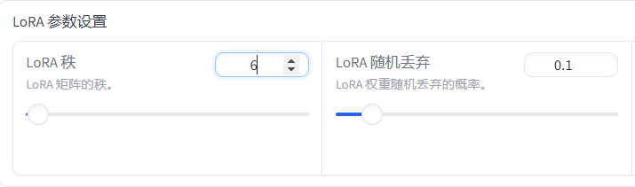
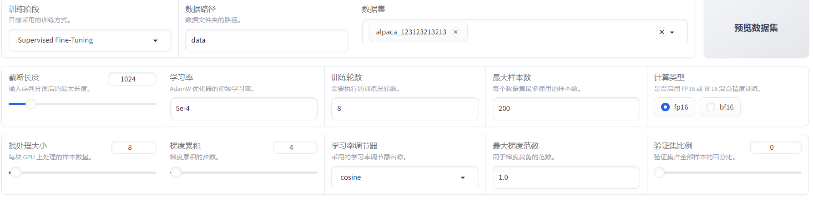

# KchatBot
nlp作业，基于LLaMA-Factory
---
* 使用ChineseLLaMA2-1.3B模型作为基座模型
* 使用爬虫爬取知乎的数据作为数据集，对模型进行指令微调
* 尝试优化模型推理效率，使用模型量化技术优化推理速度

    Model: ChineseLLaMA2-1.3B-Chat
  
    Device: Multi-GPU

  ---
  ## 数据集
  
  数据集放置在项目`data`目录下的 json 文件，json 文件示例格式和字段说明如下：
  
  ```
  {
        "instruction": "艺术的本质是什么？",
        "input": "",
        "output": "艺术家们有想让时间停止的欲望。..."
    },
    {
        "instruction": "家人得了帕金森病多年...",
        "input": "",
        "output": "1，放弃对自己使用道德标准，..."
    }
  ```

    预训练数据集的处理方法在`data/prePro.py`中,json 文件中存储一个列表，列表的每个元素是一个 sample。
## 微调参数


## 训练代码
整个项目运行在colab上，具体代码保存在`nlp`中

